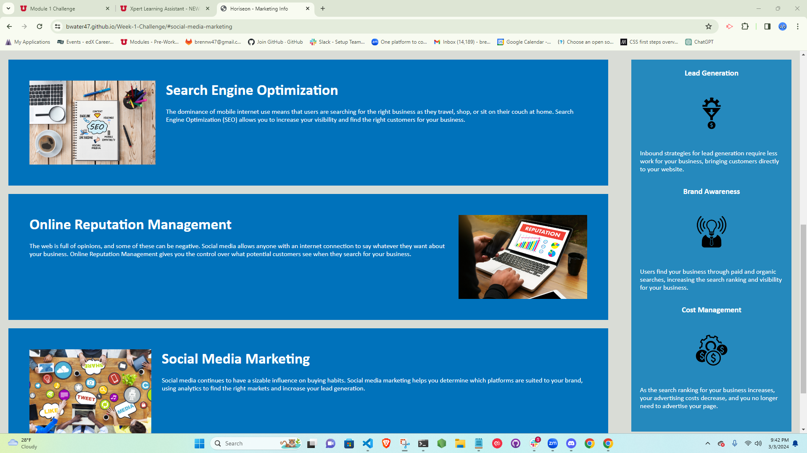
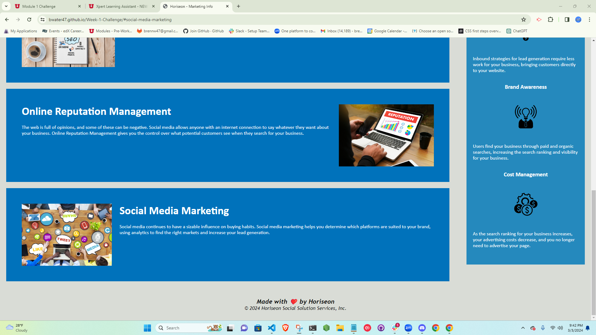

# Horiseon
Week 1 Challenge

## Description
You can click on the contents inside of the header, and it will take you to the menu that you chose. The header is located at the top of the website, and it is reactive to the cursor. You can see information about SEO, Online Reputation Management, and Social Media Marketing. There is also a benefits display on the right of the site for more information.

## Badges
Shields.io

## Visuals
Screenshot: 

## Installation
N/A

## Usage
You may use the website for gaining information on SEO, Online Reputation Management, and Social Media Marketing.

## Support
You can contact support through email by emailing brennw47@gmail.com.

## Roadmap
N/A

## Contributing
Contributing is allowed if you're in the U of U Coding Bootcamp. Contact me on on the slack channel for information.

## Authors and acknowledgment
Thank you Horiseon Social Solution Services, Inc. for hiring me on to the project.

## License
N/A

## Project status
N/A